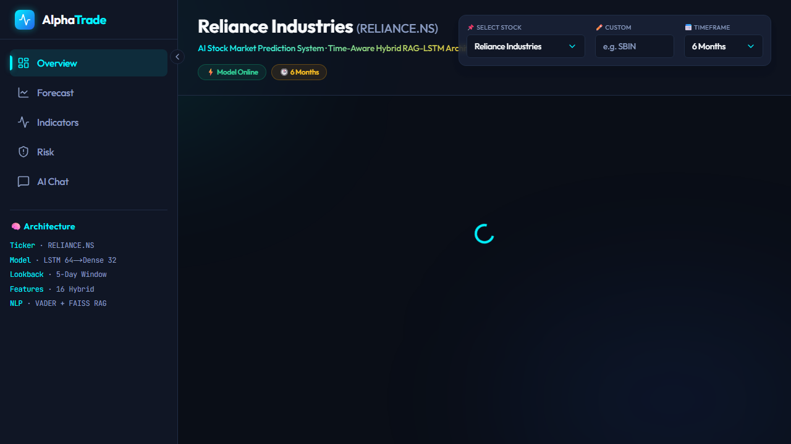
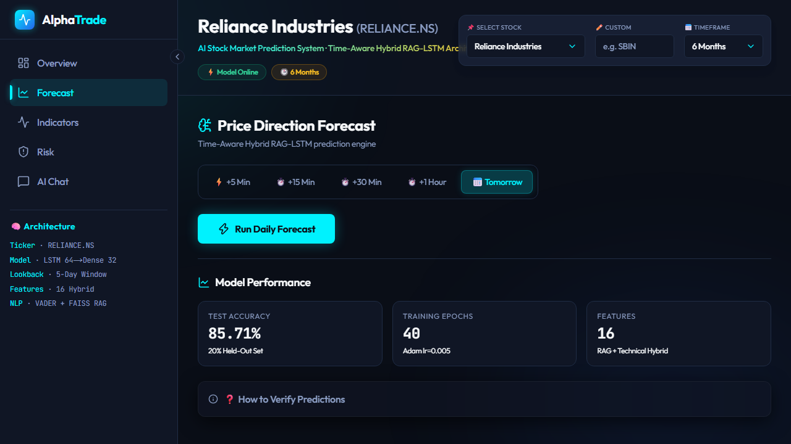
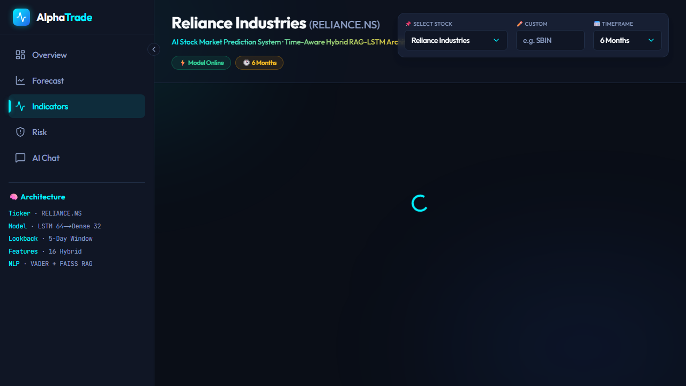
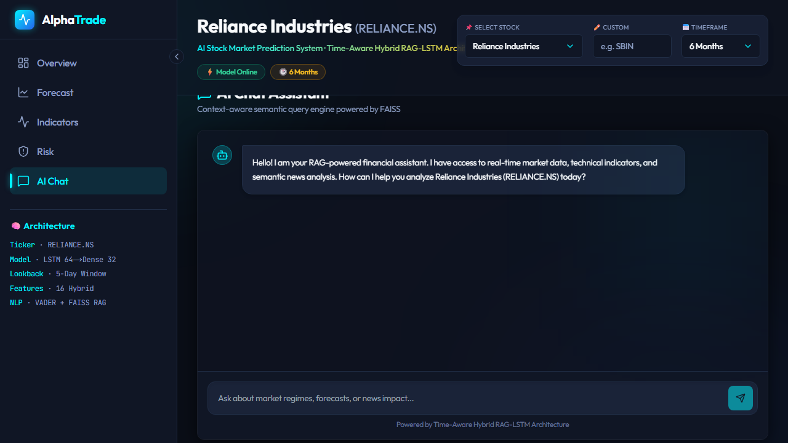
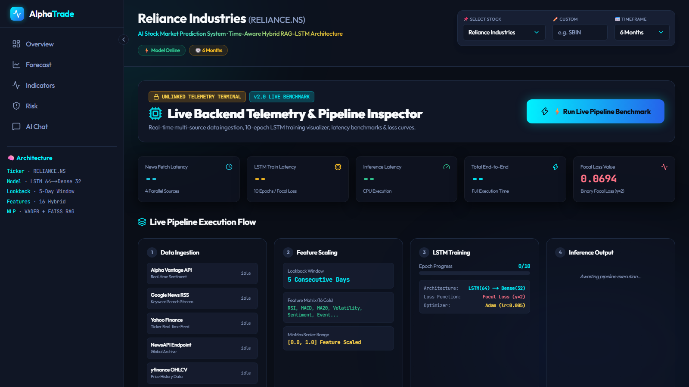
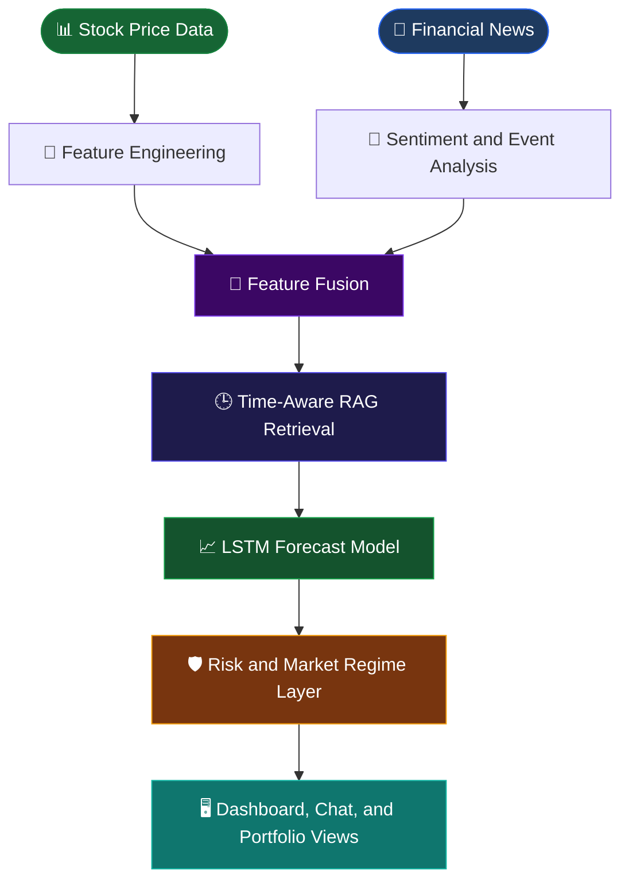
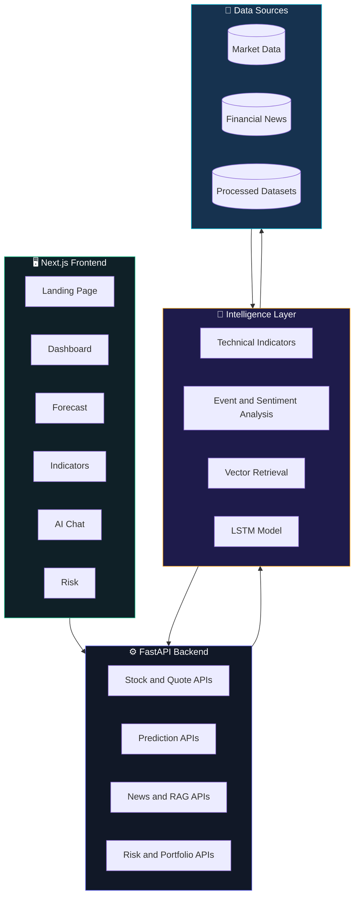

<div align="center">


<br/>


<br/>

<p>
  
  
  
  
  
</p>

<p>
  <a href="https://www.stockmarketpredictionsystem.site/">
    
  </a>
  &nbsp;
  <a href="https://github.com/abhishek-ms-01/Stock_Market_Prediction/stargazers">
    
  </a>
  &nbsp;
  <a href="https://github.com/abhishek-ms-01/Stock_Market_Prediction/issues">
    
  </a>
</p>

<br/>


<br/>

> ### _Market intelligence that combines numbers, news, and context._

<br/>

</div>

---

## 📈 What is AlphaTrade?

**AlphaTrade** is a full-stack stock market intelligence and prediction platform. It combines quantitative market features, technical indicators, financial-news retrieval, sentiment signals, risk analysis, and an LSTM forecasting model inside one investor-focused dashboard.

The platform is designed for research and decision support. It helps users explore market movement with:

- 📊 live and historical stock data
- 📐 RSI, MACD, SMA, returns, volatility, and volume features
- 📰 time-aware financial-news retrieval and sentiment analysis
- 🧠 LSTM-based short-horizon directional forecasting
- 🤖 RAG-powered conversational market analysis
- 🛡️ risk scoring, market-regime detection, and portfolio guidance

```text
📊 Market data + 📰 financial news  →  🧠 feature fusion  →  📈 forecast + 🛡️ risk context
```

> This project is an analytical research tool, not financial advice or an automated trading system.

---

## 📸 Platform Screenshots

<div align="center">

<table>
  <tr>
    <td align="center" width="50%">
      
      <br/><br/><b>🏠 Landing Page — AlphaTrade Terminal</b>
    </td>
    <td align="center" width="50%">
      
      <br/><br/><b>📊 Dashboard — Market Overview</b>
    </td>
  </tr>
  <tr>
    <td align="center" width="50%">
      
      <br/><br/><b>🧠 Forecast — Directional Prediction</b>
    </td>
    <td align="center" width="50%">
      
      <br/><br/><b>📈 Indicators — Technical and Sentiment Signals</b>
    </td>
  </tr>
  <tr>
    <td align="center" width="50%">
      
      <br/><br/><b>🤖 AI Chat — RAG Market Assistant</b>
    </td>
    <td align="center" width="50%">
      
      <br/><br/><b>⚡ Live Pipeline — Backend Telemetry and Execution Flow</b>
    </td>
  </tr>
</table>

</div>

---

## ✨ Core Features

<div align="center">

| Module | Capability | Powered By |
| :---: | --- | :---: |
| 📈 **Forecast Engine** | Predict short-horizon market direction from engineered sequences | LSTM + Keras |
| 📰 **News Intelligence** | Retrieve relevant financial news and connect events to price movement | RAG + vector search |
| 📐 **Technical Analysis** | RSI, MACD, moving averages, returns, volatility, and volume signals | Pandas + NumPy |
| 🤖 **AI Market Chat** | Explain market context and answer questions using retrieved knowledge | RAG assistant |
| 🛡️ **Risk Analysis** | Analyze volatility, market regime, exposure, and portfolio signals | Risk engine |
| ⚡ **Live Pipeline** | Bring market and news data together for dashboard analysis | FastAPI + fetchers |

</div>

### 📈 LSTM Forecasting

> Turn engineered market history into an interpretable directional outlook.

- Builds sequences from technical and market features
- Uses an LSTM model stored at `backend/models/lstm_model.h5`
- Produces forecast direction, confidence, and supporting signals
- Includes evaluation and online-training modules for research workflows

### 📰 Time-Aware RAG

> Market news matters differently depending on when it arrives.

- Indexes financial documents and news content
- Retrieves semantically relevant context for a stock or question
- Considers temporal relevance when building market context
- Feeds retrieved information into the chatbot and analysis workflow

### 📐 Technical Indicators

> Read price action through multiple quantitative lenses.

- Relative Strength Index (RSI)
- Moving averages and SMA relationships
- Moving Average Convergence Divergence (MACD)
- Returns, volatility, volume ratios, and event features

### 🛡️ Risk and Portfolio Intelligence

> Understand the risk around a signal before interpreting it.

- Volatility and risk scoring
- Market-regime detection
- Portfolio ranking and recommendation logic
- Context for comparing prediction confidence with market conditions

---

## 🔁 Prediction Workflow



---

## 🏗 System Architecture



---

## 🧠 Tech Stack

<div align="center">

**Frontend**


**Backend and Machine Learning**


**Market Intelligence**


</div>

---

## 📁 Folder Structure

```text
Stock_Market_Prediction/
│
├── backend/
│   ├── main.py                    # FastAPI entry point and stock APIs
│   ├── app/api/routes.py          # Application routes
│   ├── data_ingestion/            # Market and news fetchers
│   ├── feature_engineering/       # Model-ready feature creation
│   ├── indicators/                # RSI, MACD, and moving averages
│   ├── models/                    # Neural models and saved LSTM model
│   ├── nlp/                       # Financial NLP and event extraction
│   ├── prediction/                # Training, evaluation, and inference
│   ├── rag/                       # Financial graph and time-aware RAG
│   ├── risk/                      # Risk analysis logic
│   ├── sentiment/                 # Sentiment processing
│   ├── chatbot/                   # Market assistant and retrieval flow
│   ├── data/                      # CSV datasets and processed data
│   └── requirements.txt           # Python dependencies
│
├── frontend/
│   ├── src/app/                   # Next.js pages and dashboard routes
│   ├── src/components/            # Charts, layout, and metric components
│   ├── src/hooks/                 # Data-fetching hooks
│   ├── src/lib/api/               # API client and shared types
│   └── package.json               # Frontend dependencies
│
├── screenshots/                   # README product screenshots
├── HOW_IT_WORKS.md                # Detailed technical explanation
├── docker-compose.yml              # Container orchestration configuration
└── README.md                      # Project documentation
```

---

## 🚀 Installation and Setup

### Prerequisites

| Tool | Version |
| --- | --- |
| Python | 3.10+ |
| Node.js | 18+ |
| npm | 9+ |
| Git | Latest |

### 1. Clone the Repository

```bash
git clone https://github.com/abhishek-ms-01/Stock_Market_Prediction.git
cd Stock_Market_Prediction
```

### 2. Set Up the Backend

```bash
cd backend
python -m venv .venv

# Windows
.venv\Scripts\activate

# macOS/Linux
source .venv/bin/activate

pip install -r requirements.txt
```

### 3. Configure Environment Variables

```bash
# From the backend directory
copy .env.example .env        # Windows
# cp .env.example .env        # macOS/Linux
```

Add the API credentials required by your selected market and news providers to `backend/.env`. Never commit private keys or tokens.

### 4. Start the Backend

```bash
cd backend
python -m uvicorn main:app --host 0.0.0.0 --port 8000 --reload
```

### 5. Start the Frontend

Open a second terminal:

```bash
cd frontend
npm install
npm run dev
```

Open the live application at **https://www.stockmarketpredictionsystem.site/**. For local development, the dashboard runs at **http://localhost:3000** and the API runs at **http://localhost:8000**.

---

## 📡 Main API Routes

| Method | Route | Purpose |
| :---: | --- | --- |
| `GET` | `/api/stocks` | Available stock symbols and market data |
| `GET` | `/api/stock-data` | Historical stock data and indicators |
| `GET` | `/api/quote/realtime` | Current quote information |
| `GET` | `/api/forecast` | Forecast and directional signal |
| `GET` | `/api/predict` | Prediction output for a selected symbol |
| `POST` | `/api/chat` | RAG-powered market conversation |
| `GET` | `/api/risk` | Risk and market-condition analysis |
| `GET` | `/api/portfolio` | Portfolio guidance and ranking signals |
| `POST` | `/api/train-model` | Trigger model-training workflow |

---

## 📊 Dashboard Modules

<div align="center">

| # | Module | Route | Description |
| :-: | --- | --- | --- |
| 1 | 🏠 Landing | `/` | AlphaTrade introduction and product entry point |
| 2 | 📊 Dashboard | `/dashboard` | Market overview, metrics, and chart context |
| 3 | 🧠 Forecast | `/dashboard/forecast` | Prediction direction and model signals |
| 4 | 📈 Indicators | `/dashboard/indicators` | Technical and sentiment indicators |
| 5 | 🤖 AI Chat | `/dashboard/ai-chat` | Context-aware financial assistant |
| 6 | 🛡️ Risk | `/dashboard/risk` | Risk, regime, and portfolio analysis |
| 7 | ⚡ Live Pipeline | `/dashboard/live-pipeline` | Data-ingestion and processing visibility |

</div>

---

## 🔬 Research Notes

AlphaTrade is intended for educational, research, and dashboard exploration workflows. Forecasts are probabilistic outputs from historical and contextual data. They can be affected by data freshness, market regime changes, news quality, model drift, and unexpected events.

Do not use the application as a substitute for professional financial advice. Validate signals independently and apply appropriate risk management before making investment decisions.

---

## 🔮 Roadmap

<div align="center">

| Status | Planned Improvement |
| :---: | --- |
| 🔜 | Broader real-time market-provider integrations |
| 🔜 | More robust model calibration and uncertainty reporting |
| 🔜 | Expanded event taxonomy for financial news |
| 🔜 | Walk-forward validation and automated model monitoring |
| 🔜 | Portfolio backtesting and scenario analysis |
| 🔜 | Cloud deployment with production observability |

</div>

---

## 🤝 Contributing

Contributions, experiments, and improvements are welcome.

```bash
git checkout -b feature/your-improvement
# make your changes
git add .
git commit -m "feat: describe your improvement"
git push origin feature/your-improvement
```

Then open a pull request with a clear explanation of the change and its validation.

---

## 📄 License

This project is provided for educational and research purposes. Review the repository contents and applicable third-party terms before commercial deployment.

---

## 👨‍💻 Author

<div align="center">

_Full-Stack AI Developer · Market Intelligence Builder_

<br/>

[](https://github.com/abhishek-ms-01)
&nbsp;&nbsp;
[](https://github.com/abhishek-ms-01/Stock_Market_Prediction)

<br/>

</div>

---

<div align="center">


<br/>

**Built with data, models, and market context.**

</div>
