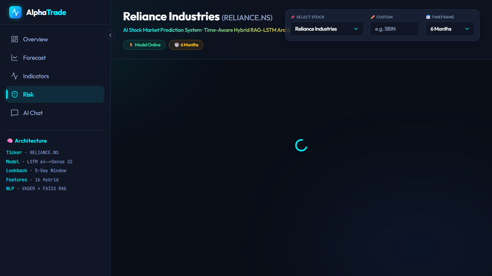
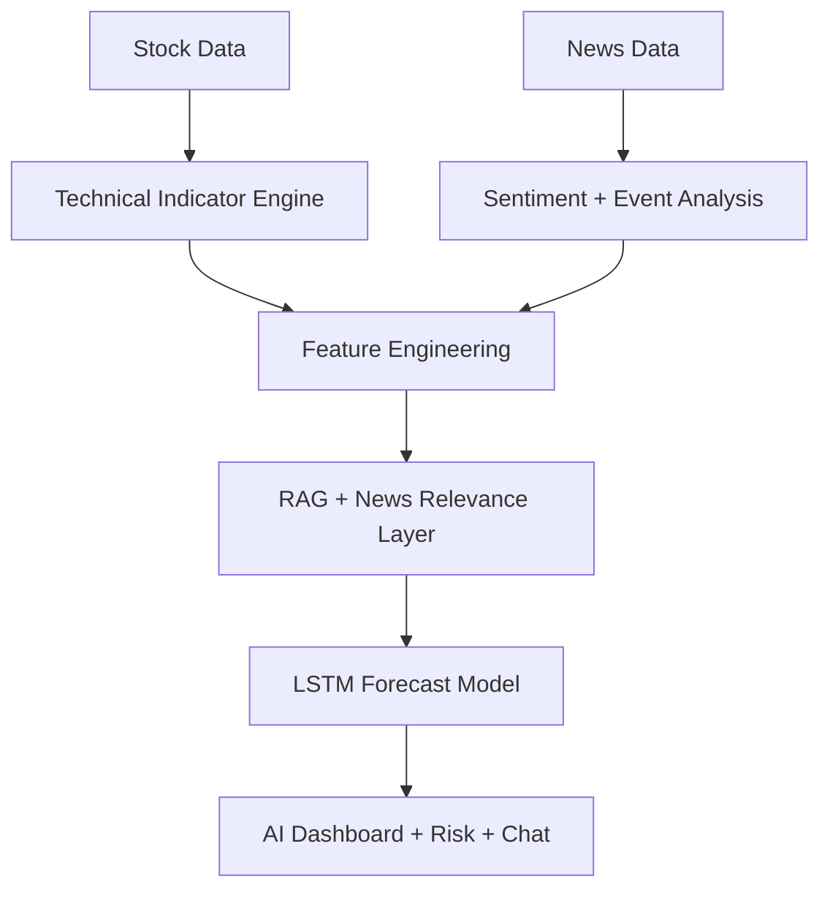

<div align="center">
  

  <br />
  <br />

  # 📈 AlphaTrade: Predictive Intelligence v2.0
  **EVENT-DRIVEN STOCK MARKET PREDICTION SYSTEM USING RAG-LSTM**

  <p align="center">
    <a href="#problem-statement">Problem</a> •
    <a href="#why-alphatrade">Why AlphaTrade?</a> •
    <a href="#features">Features</a> •
    <a href="#technologies">Tech Stack</a> •
    <a href="#system-architecture">Architecture</a> •
    <a href="#getting-started">Installation</a>
  </p>
</div>

---

## 🛑 Problem Statement
Retail investors face a major disadvantage in fast-moving markets. Most trading tools still rely on lagging technical indicators or one-dimensional price history, which ignores the most important catalysts: breaking news, earnings reports, macroeconomic signals, and market sentiment.

This project solves that gap by creating a hybrid AI system that combines:

- real-time stock market data
- technical indicators like RSI, MACD, SMA, and volatility
- live or processed financial news sentiment
- retrieval-based semantic analysis with RAG
- LSTM-based forecasting for short-term price direction

The final result is a full-stack dashboard that helps users analyze market movement using both quantitative and qualitative intelligence.

---

## 💡 Why AlphaTrade?
AlphaTrade is designed for a new class of market intelligence systems that go beyond raw candle data.

Instead of just analyzing OHLCV charts, the platform uses a time-aware hybrid architecture where:

1. the model reads stock data
2. computes technical indicators
3. retrieves relevant financial news using semantic search
4. scores the market context with sentiment and event relevance
5. predicts the next directional move using a deep learning LSTM network
6. exposes the result through an AI assistant and dashboard UI

This makes the system feel closer to a professional analyst workflow than a simple charting tool.

---

## 📸 Live Screenshots

<div align="center">

<table>
  <tr>
    <td align="center" width="50%">
      
      <br /><br /><b>🏠 Landing Page</b>
    </td>
    <td align="center" width="50%">
      
      <br /><br /><b>📊 Market Overview Dashboard</b>
    </td>
  </tr>
  <tr>
    <td align="center" width="50%">
      
      <br /><br /><b>🧠 Forecast Engine</b>
    </td>
    <td align="center" width="50%">
      
      <br /><br /><b>📈 Technical Indicators</b>
    </td>
  </tr>
  <tr>
    <td align="center" width="50%">
      
      <br /><br /><b>🤖 RAG AI Chat Assistant</b>
    </td>
    <td align="center" width="50%">
      
      <br /><br /><b>🛡️ Risk & Portfolio Analysis</b>
    </td>
  </tr>
</table>

</div>

---

## ✨ Core Features

### 1. Event-Driven Stock Forecasting
- Predicts directional price movement using a time-aware hybrid model
- Uses short lookback sequences from technical and sentiment features
- Supports multiple horizons such as intraday and daily forecasting

### 2. RAG-Powered Financial Chat Assistant
- Answers user questions using stock context and news relevance
- Retrieves semantically similar market news articles
- Explains model output using financial knowledge and current context

### 3. Technical Analysis Dashboard
- View OHLCV-based trend data
- Evaluate RSI, MACD, moving averages, volatility, and other market signals
- Visualize price action with an interactive charting experience

### 4. Risk Framework
- Calculates risk metrics such as volatility score and VaR-like estimates
- Detects market regime using volatility and moving-average behavior
- Provides portfolio recommendation logic based on ranking signals

### 5. Live Market and News Integration
- Fetches stock data from Yahoo Finance and related sources
- Uses data ingestion modules for price and news processing
- Builds a pipeline around event-driven sentiment and price movement analysis

---

## 🧠 Model & Architecture Overview

The project blends three major signals:

- Quantitative features: RSI, MACD, returns, volatility, SMA ratio, volume ratio
- Semantic features: news sentiment, event classification, relevance scoring
- Deep learning: LSTM model trained on 5-step historical market sequences

The overall flow is:



The architecture is built as a hybrid system where numerical price behavior and textual market information are both considered before generating a market outlook.

---

## 🛠️ Tech Stack

### Frontend
- Next.js 14
- React
- TypeScript
- Tailwind CSS
- Framer Motion
- Recharts
- lightweight-charts
- Zustand state management

### Backend
- FastAPI
- Python
- Pandas
- NumPy
- scikit-learn
- TensorFlow / Keras
- yfinance
- NLTK
- FAISS
- News API & market data fetchers

### AI / Analytics Layer
- LSTM neural network forecasting
- RSI, MACD, MA, volatility feature extraction
- event-aware sentiment analysis
- semantic retrieval using vector search
- market regime detection and risk analysis

---

## 📂 Project Structure

```text
stock_market_prediction-with-RAG_LSTM-main/
├── backend/
│   ├── app/
│   │   ├── api/
│   │   │   └── routes.py
│   │   └── main.py
│   ├── chatbot/
│   │   ├── chatbot.py
│   │   └── rag_engine.py
│   ├── data_ingestion/
│   │   ├── live_news_fetcher.py
│   │   ├── multi_source_fusion.py
│   │   ├── upstox_fetcher.py
│   │   └── ...
│   ├── event_detection/
│   ├── feature_engineering/
│   ├── indicators/
│   ├── market_regime/
│   ├── models/
│   │   ├── lstm_model.h5
│   │   └── neural_models.py
│   ├── nlp/
│   ├── portfolio/
│   ├── prediction/
│   │   ├── online_trainer.py
│   │   ├── predict.py
│   │   ├── train_lstm.py
│   │   └── evaluate_models.py
│   ├── rag/
│   │   ├── financial_graph.py
│   │   └── time_aware_rag.py
│   ├── risk/
│   ├── sentiment/
│   ├── utils/
│   ├── main.py
│   ├── requirements.txt
│   └── .env.example
├── frontend/
│   ├── src/
│   ├── package.json
│   ├── next.config.mjs
│   └── ...
├── screenshots/
│   ├── landing.png
│   ├── dashboard.png
│   ├── forecast.png
│   ├── indicators.png
│   ├── ai-chat.png
│   └── risk.png
├── docker-compose.yml
├── HOW_IT_WORKS.md
├── README.md
└── .gitignore
```

---

## 🔄 How the System Works

### 1. Data Collection
The system gathers price history and related market context from financial sources and data fetchers.

### 2. Indicator Engineering
Features such as RSI, MACD, return ratios, volatility, and volume normalization are computed from historical data.

### 3. News & Semantic Integration
Relevant news contextualizes the price series. The system scores sentiment and compares arrival time with market periods.

### 4. Forecast Generation
A sequence of engineered features is fed into an LSTM model that produces a directional signal and confidence score.

### 5. Risk & Decision Layer
The platform estimates risk, identifies regime state, and produces decision-focused views for users and portfolio logic.

### 6. User Experience Layer
The dashboard and chatbot present the output in a visually rich, investor-friendly interface.

---

## 🚀 Getting Started

### Prerequisites
- Python 3.10+
- Node.js 18+
- npm
- Git

### 1. Clone the Repository

```bash
git clone https://github.com/abhishek-ms-01/Stock_Market_Prediction.git
cd Stock_Market_Prediction
```

### 2. Backend Setup

```bash
cd backend
python -m venv .venv
# Windows
.venv\Scripts\activate
# macOS/Linux
source .venv/bin/activate

pip install -r requirements.txt
```

### 3. Configure Environment Variables
Copy the example file and fill in the necessary API keys:

```bash
cp .env.example .env
```

Then update the values for:

- News API
- Finnhub
- Upstox / Zerodha credentials
- any additional market data configuration keys

### 4. Run the Backend

```bash
cd backend
python -m uvicorn main:app --host 0.0.0.0 --port 8000 --reload
```

### 5. Run the Frontend
Open a second terminal and run:

```bash
cd frontend
npm install
npm run dev
```

The dashboard will be available at:

```text
http://localhost:3000
```

The API will be available at:

```text
http://localhost:8000
```

---

## 📡 Main API Routes

The backend exposes endpoints for stock data, forecasting, chat, risk, and portfolio intelligence.

- `GET /api/stocks`
- `GET /api/stock-data`
- `GET /api/quote/realtime`
- `POST /api/chat`
- `GET /api/forecast`
- `GET /api/predict`
- `POST /api/train-model`
- `GET /api/risk`
- `GET /api/portfolio`

These endpoints feed the dashboard and provide the data needed by the AI assistant and model interface.

---

## 🧪 Notes on Model Behavior

The prediction engine is designed for short-horizon directional analysis and should be understood as an analytical tool rather than a guaranteed trading signal. It is most useful when combined with:

- human judgment
- risk management
- broader market context
- additional technical or macro research

The platform is optimized for prototype, research, and dashboard exploration workflows rather than direct production trading execution.

---

## 📘 Additional Documentation

For the full technical breakdown, review:

- `HOW_IT_WORKS.md`
- backend model and engine modules under `backend/`
- frontend dashboard features under `frontend/src/app/dashboard/`

---

## 🤝 Contribution

Contributions, ideas, and improvements are welcome.

```bash
git checkout -b feature/my-improvement
# make changes
git commit -m "feat: add market signal enhancement"
git push origin feature/my-improvement
```

---

## 📄 License

This project is provided for educational and research-oriented use. Please review the repository license before commercial deployment.

---

## 👨‍💻 Project Summary

AlphaTrade is a research-driven stock intelligence platform that fuses:

- deep learning prediction
- time-aware market news retrieval
- technical analysis
- risk profiling
- AI-based conversational analysis

It is built to help traders and researchers understand market movement with both data and contextual reasoning, all within a single intelligent terminal.

<div align="center">
  
</div>

